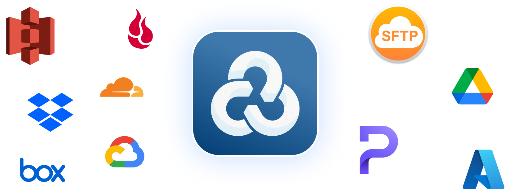
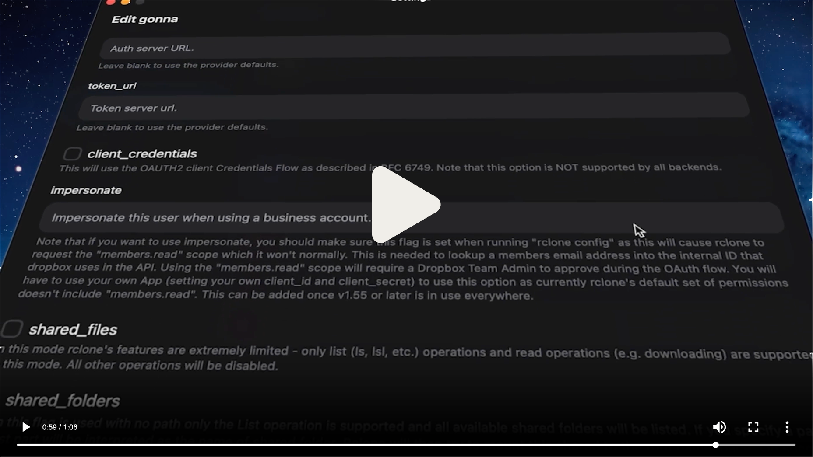

<h1 align="center">
  <a href="https://rcloneui.com">
    
  </a>
  <br>
  <a href="https://rcloneui.com">
    The cross-platform GUI for Rclone
  </a>
</h1>

<h3 align="center">
  <strong>A light, transparent layer on top of <tt>rclone</tt> to manage your remotes &amp; tasks in a more user-friendly way.</strong>
</h3>

<br />

<p align="center">
	<a href="https://discord.gg/rclone">
    
  </a>
   &nbsp;
  <a href="https://github.com/rclone-ui/rclone-ui?tab=readme-ov-file#package-managers">
  
  </a>
</p>

<br />

<a href="https://get.rcloneui.com/showcase">
  
</a>

## Package Managers

<table>
<tr>
<td></td>
<td width="700">

```bash
flatpak install com.rcloneui.RcloneUI
```

</td>
</tr>
<tr>
<td></td>
<td>

```bash
brew install --cask rclone-ui
```

</td>
</tr>
<tr>
<td></td>
<td>

```bash
scoop bucket add extras && scoop install rclone-ui
```

</td>
</tr>
<tr>
<td></td>
<td>

```bash
choco install rclone-ui
```

</td>
</tr>
<tr>
<td></td>
<td>

```bash
winget install --id=RcloneUI.RcloneUI -e
```

</td>
</tr>
<tr>
<td></td>
<td>

```bash
npx rclone-ui
```

</td>
</tr>
<tr>
<td><a href="https://apple.com"></a></td>
<td><a href="https://apple.com"><b>Tap here to open the Apple App Store</b></a></td>
</tr>
<tr>
<td><a href="https://google.com"></a></td>
<td><a href="https://google.com"><b>Tap here to open the Google Play Store</b></a></td>
</tr>
</table>

## Downloads
- **Windows** (**[Arm](https://get.rcloneui.com/win-arm)**, **[x64](https://get.rcloneui.com/win)**)
- **macOS** (**[Apple Silicon](https://get.rcloneui.com/mac)**, **[Intel](https://get.rcloneui.com/mac64)**)
- **Linux** (**[AppImage](https://get.rcloneui.com/linux)**, **[deb](https://get.rcloneui.com/linux-deb)**, **[rpm](https://get.rcloneui.com/linux-rpm)**)
- **Linux `Arm`** (**[AppImage](https://get.rcloneui.com/linux-arm)**, **[deb](https://get.rcloneui.com/linux-deb-arm)**, **[rpm](https://get.rcloneui.com/linux-rpm-arm)**)

## Docker/Homelab/Server Usage
Control your server, homelab, or mom's PC with **the easiest solution to manage remote **`rclone`** instances.**

[**Check out the guide for controlling remote instances.**](https://rcloneui.com/docs/ui/docker)

## Roadmap
> Finalized items have been moved to the "Features" section.
### [Check out the V3 discussion!](https://github.com/rclone-ui/rclone-ui/issues/18)

## 1 Star = 1 Instant Coffee
<a href="https://www.star-history.com/#rclone-ui/rclone-ui&Timeline">
 <picture>
   <source media="(prefers-color-scheme: dark)" srcset="https://api.star-history.com/svg?repos=rclone-ui/rclone-ui&type=Timeline&theme=dark" />
   <source media="(prefers-color-scheme: light)" srcset="https://api.star-history.com/svg?repos=rclone-ui/rclone-ui&type=Timeline" />
   
 </picture>
</a>

## Contributing
Welcome, anon. We’ve been expecting you.

Here are some good problems to tackle:
- Fix an open [**Issue**](https://github.com/rclone-ui/rclone-ui/issues)
- Upgrade repository to Vite 7 & React 19
- Introduce React Compiler
- Move Cron logic to Rust

🎁 **Merged PRs receive a Lifetime License!**

<br />

<p align="center">
  <a href="https://github.com/rclone-ui/rclone-ui/blob/main/README.md">
  	
  </a>
  <a href="https://github.com/rclone-ui/rclone-ui/blob/main/README_CHINESE.md">
    
  </a>
  <a href="https://github.com/rclone-ui/rclone-ui/blob/main/README_JAPANESE.md">
    
  </a>
  <a href="https://github.com/rclone-ui/rclone-ui/blob/main/README_POLISH.md">
    
  </a>
  <a href="https://github.com/rclone-ui/rclone-ui/blob/main/README_GERMAN.md">
    
  </a>
  <a href="https://github.com/rclone-ui/rclone-ui/blob/main/README_SPANISH.md">
    
  </a>
  <a href="https://github.com/rclone-ui/rclone-ui/blob/main/README_ROMANIAN.md">
    
  </a>
  <a href="https://github.com/rclone-ui/rclone-ui/blob/main/README_PIRATE.md">
    
  </a>
</p>
