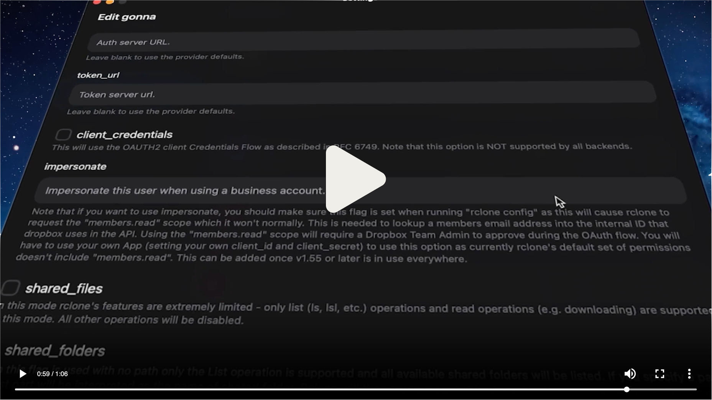

<h1 align="center">
  <a href="https://rcloneui.com">
    
  </a>
  <br>
  <a href="https://rcloneui.com">
    Interfața Desktop pentru Rclone
  </a>
</h1>

<h3 align="center">
  <strong>Un layer transparent peste <tt>rclone</tt> pentru a gestiona Remotes & Tasks într-un mod mai user-friendly.</strong>
</h3>

<br />

<p align="center">
   <a href="https://github.com/rclone-ui/rclone-ui/releases/latest">
    
  </a>
  &nbsp;
  <a href="https://github.com/rclone-ui/rclone-ui?tab=readme-ov-file#downloads">
    
  </a>
  &nbsp;
  <a href="https://tauri.app/?ref=rclone-ui">
    
  </a>
</p>

<p align="center">
   <a href="#package-managers">
    
  </a>
 &nbsp;
   <a href="#package-managers">
    
  </a>
 &nbsp;
   <a href="#package-managers">
    
  </a>
</p>

<p align="center">
  <a href="https://github.com/rclone-ui/rclone-ui/stargazers">
    
  </a>
</p>

<br />

<a href="https://get.rcloneui.com/showcase">
  
</a>

## Docker/Homelab/Server
Controlează serverul, homelab-ul sau PC-ul mamei tale cu **cea mai simplă soluție pentru a gestiona instanțe **`rclone`** la distanță.**

#### Docker Compose
```yaml
services:
  rclone:
    image: rclone/rclone
    container_name: rclone
    command: rcd --rc-addr=0.0.0.0:5572 --rc-no-auth
    ports:
      - 5572:5572
    volumes:
      - ./config:/config/rclone
      - /path/to/data:/data
```

#### Docker CLI
```bash
docker run -d \
  --name rclone \
  -p 5572:5572 \
  -v ./config:/config/rclone \
  -v /path/to/data:/data \
  rclone/rclone rcd --rc-addr=0.0.0.0:5572 --rc-no-auth
```

#### Fără Docker
Pornește daemon-ul `rcd` direct:

```bash
rclone rcd --rc-addr=0.0.0.0:5572 --rc-no-auth
```

#### Note
- După pornirea **`rclone`** folosind metoda preferată, deschide Rclone UI și navighează la Settings > Hosts.
- Asigură-te că permiți traficul pe portul **`5572`** în firewall-ul tău și/sau reverse proxy (nginx/caddy/traefik).
- Rclone UI se poate conecta la orice port RCD, astfel încât poți personaliza portul implicit **`5572`**.
- Folosește **`--rc-user`** și **`--rc-pass`** în loc de **`--rc-no-auth`** în producție.

## Package Managers
- Flathub **`flatpak install com.rcloneui.RcloneUI`** sau **[din magazin](https://flathub.org/en/apps/com.rcloneui.RcloneUI)**
- Brew **`brew install --cask rclone-ui`**
- Scoop **`scoop bucket add extras`** & **`scoop install rclone-ui`**
- Chocolatey **`choco install rclone-ui`**
- WinGet **`winget install --id=RcloneUI.RcloneUI  -e`**
- NPM **`npx rclone-ui`**

## Descarcă
- **Windows** (**[Arm](https://get.rcloneui.com/win-arm)**, **[x64](https://get.rcloneui.com/win)**)
- **macOS** (**[Apple Silicon](https://get.rcloneui.com/mac)**, **[Intel](https://get.rcloneui.com/mac64)**)
- **Linux** (**[AppImage](https://get.rcloneui.com/linux)**, **[deb](https://get.rcloneui.com/linux-deb)**, **[rpm](https://get.rcloneui.com/linux-rpm)**)
- **Linux `Arm`** (**[AppImage](https://get.rcloneui.com/linux-arm)**, **[deb](https://get.rcloneui.com/linux-deb-arm)**, **[rpm](https://get.rcloneui.com/linux-rpm-arm)**)

## Roadmap
> Itemi finalizati au fost mutați în secțiunea „Features”.
### [Vezi discuția pentru V3!](https://github.com/rclone-ui/rclone-ui/issues/37)

## 1 Star = 1 Cafea Instant
<a href="https://www.star-history.com/#rclone-ui/rclone-ui&Timeline">
 <picture>
   <source media="(prefers-color-scheme: dark)" srcset="https://api.star-history.com/svg?repos=rclone-ui/rclone-ui&type=Timeline&theme=dark" />
   <source media="(prefers-color-scheme: light)" srcset="https://api.star-history.com/svg?repos=rclone-ui/rclone-ui&type=Timeline" />
   
 </picture>
</a>

## Contribuții
Bine ai venit, anon. Te-așteptam.

Iată câteva probleme bune de abordat:
- Rezolvă un [**Issue**](https://github.com/rclone-ui/rclone-ui/issues) deschis
- Actualizează repository-ul la Vite 7 & React 19
- Introdu React Compiler
- Mută logica Cron în Rust

🎁 **PR-urile acceptate primesc o licență gratis!**

<br />

<p align="center">
  <a href="https://github.com/rclone-ui/rclone-ui/blob/main/README.md">
    
  </a>
  <a href="https://github.com/rclone-ui/rclone-ui/blob/main/README_CHINESE.md">
    
  </a>
  <a href="https://github.com/rclone-ui/rclone-ui/blob/main/README_JAPANESE.md">
    
  </a>
  <a href="https://github.com/rclone-ui/rclone-ui/blob/main/README_POLISH.md">
    
  </a>
  <a href="https://github.com/rclone-ui/rclone-ui/blob/main/README_GERMAN.md">
    
  </a>
  <a href="https://github.com/rclone-ui/rclone-ui/blob/main/README_SPANISH.md">
    
  </a>
  <a href="https://github.com/rclone-ui/rclone-ui/blob/main/README_ROMANIAN.md">
  
  </a>
  <a href="https://github.com/rclone-ui/rclone-ui/blob/main/README_PIRATE.md">
    
  </a>
</p>